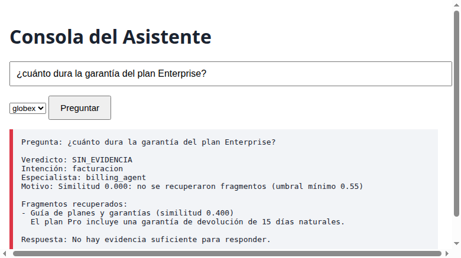

# Notas de entrega — Sebato

## Resumen

Los seis ejercicios de la implementación están completos y la suite actual tiene
41 tests exitosos. Además de completar la trazabilidad documental del ejercicio
4, se corrigió la experiencia HTTP del navegador: el formulario tiene fallback
GET, las respuestas HTML escapan datos y las consultas vacías conservan una
página de error legible.

## Tiempo

- Inicio de esta revisión: **2026-09-26 16:22:07 -05**.
- Entrega observada: **2026-09-26 19:12:45 -05**.
- Esfuerzo aproximado por ejercicio: E1 0.5 h, E2 0.5 h, E3 1 h, E4 0.75 h,
  E5 0.5 h, E6 1.25 h. Total aproximado: 4.5 h.

## Decisiones

### Tres decisiones de las que estoy seguro

1. Mantener `get_db_client()` como singleton evita clientes duplicados y respeta
   el contrato explícito de `shared/clients.py`.
2. Abstenerse con `SIN_EVIDENCIA` cuando el puntaje es insuficiente evita
   convertir similitud léxica en una afirmación del producto.
3. Copiar los resultados al entrar y salir de la caché evita que un consumidor
   contamine las respuestas de otra consulta.

### Dos decisiones que revisaría

1. Revisaría el umbral 0.80 con métricas reales de preguntas y falsos positivos;
   lo cambiaría solo si un conjunto etiquetado demuestra mejor precisión/recall.
2. Revisaría `DUDOSO` con datos de revisión humana; si el volumen es alto,
   añadiría una cola con SLA antes de endurecerlo a rechazo.

## Ejercicio 1 — reglas vs LLM

Las reglas son deterministas, baratas y auditables: ante la misma entrada
producen la misma intención y no requieren ejemplos ni latencia de red. Su
desventaja es que no entienden bien sinónimos ni formulaciones nuevas; el
catálogo debe mantenerse manualmente. Cambiaría a un clasificador entrenado o a
un LLM cuando las consultas reales mostraran demasiados mensajes desconocidos y
hubiera un conjunto etiquetado para medir precisión, costo y regresiones. Aun
así conservaría reglas para casos críticos y una abstención explícita.

## Ejercicio 3 — tabla de defectos

Las líneas siguientes son las del código original de referencia en commit
`8c98f9f`; el archivo actual ya contiene las correcciones.

| # | Línea | Qué está mal | Síntoma que produce en producción | Gravedad |
|---:|---:|---|---|---|
| 1 | 20 | `cache={}` es mutable y global al proceso. | El segundo usuario puede recibir respuestas filtradas o datos cacheados del primero. | Crítica |
| 2 | 21 | La clave de caché ignora `min_similitud`. | Una consulta con umbral alto puede reutilizar resultados calculados con otro umbral y filtrar incorrectamente. | Alta |
| 3 | 24 | Instancia `DatabaseClient` dentro de cada llamada. | Aumenta conexiones/recursos y rompe el singleton exigido; bajo carga degrada el servicio. | Alta |
| 4 | 32–34 | Busca y deserializa la fuente antes de aplicar el umbral. | Una respuesta que debía descartarse puede fallar por una fuente dañada o inexistente. | Alta |
| 5 | 34 | Accede a `source.to_dict()["titulo"]` sin comprobar existencia. | El caso `src-99-inexistente` lanza `KeyError` y aborta toda la consulta del workspace. | Crítica |
| 6 | 37 | Escribe JSON sin `ensure_ascii=False` ni `encoding`. | Títulos o respuestas no ASCII pueden almacenarse con escapes o codificación dependiente del entorno. | Media |
| 7 | 39 | Guarda y devuelve la misma lista mutable. | Un consumidor que edite una respuesta corrompe la caché y las consultas posteriores. | Alta |

La regresión `tests/test_legacy_answers.py::test_answers_filtra_antes_de_buscar_fuente_y_tolera_fuente_inexistente`
protege la fuente ausente; `test_cache_separa_umbral_y_protege_sus_resultados_de_mutaciones`
protege las claves por umbral y las copias defensivas.

## Ejercicio 4 — qué movería a código determinista

Movería a código la validación de esquema, la existencia de `source_id`, la
validez de `chunk`, la comprobación de que `similitud` es numérica y la
comparación literal de la cita contra el documento recuperado. Esas operaciones
son binarias y reproducibles; un LLM puede aceptar una paráfrasis o inventar que
una fuente existe. Dejaría al prompt la evaluación semántica de si la cita cubre
cada afirmación y si hay contradicción, porque requiere interpretar lenguaje.
El código impondría los umbrales después de esa salida, no confiaría solo en el
veredicto textual del modelo.

## Ejercicio 6 — cómo mejoraría el recuperador

Añadiría recuperación híbrida: BM25 o TF-IDF para precisión léxica y embeddings
para similitud semántica, con filtros por workspace y metadatos. Evaluaría un
conjunto etiquetado con recall@k, precisión y casos de abstención, incluyendo
sinónimos como “restablecer contraseña” y “recuperar acceso”. El costo sería
operar un índice vectorial, generar embeddings, versionarlos al cambiar el
corpus y asumir latencia y consumo adicionales. Mantendría el recuperador
léxico como fallback determinista y exigiría una cita literal antes de mostrar
una respuesta.

## Ejercicio 5 — dónde enchufo la guardia

La enchufaría en el dispatcher central que ejecuta cualquier llamada de agente,
justo antes de invocar la herramienta y con la clave `(session_id, agent_id)`.
Así todas las herramientas quedan cubiertas aunque un agente nuevo no recuerde
llamar al guardia. En cada herramienta se duplicaría la lógica, sería fácil
olvidarla y los límites podrían diferir. El dispatcher debe registrar el
intento, lanzar `ToolLoopError` al superar `MAX_CALLS` y conservar aislamiento
por sesión/agente; resetearía solo al finalizar una sesión o flujo controlado.

## Uso de IA

Usé un asistente de IA en esta auditoría para leer el PDF y el repositorio,
contrastar el prompt v1 con el baseline `8c98f9f`, proponer el contrato v2,
redactar los casos a-1..a-5, revisar la estructura de `NOTAS.md` y ejecutar los
tests. Verifiqué manualmente los textos contra `fixtures/db.json`, las líneas
del baseline y los resultados de pytest; la IA no fue tratada como evidencia.

## Qué haría con una semana más

Añadiría tests automatizados que parseen el esquema JSON de v2 y validen los
cinco casos contra una implementación de referencia; mediría recuperación
híbrida con un corpus etiquetado; probaría accesibilidad del HTML; y haría una
revisión manual de seguridad, trazabilidad y observabilidad del pipeline.

## Verificación reproducible

Desde `starter_kit/starter_kit` ejecuté:

```bash
.venv/bin/python -m pytest tests/test_verificador_prompt.py
# 1 passed, exit code 0
.venv/bin/python -m pytest
# 41 passed, exit code 0
```

Los comandos terminaron con código 0. No se modificaron `shared/clients.py`,
`shared/retriever.py`, `fixtures/`, `pytest.ini` ni `requirements.txt`. La
implementación de `app.py` sí recibió los fixes de fallback HTML y validación.

## Evidencia de la consola Enterprise

La captura muestra la pregunta del plan Enterprise y la abstención explícita
cuando el mejor fragmento queda por debajo del umbral:


